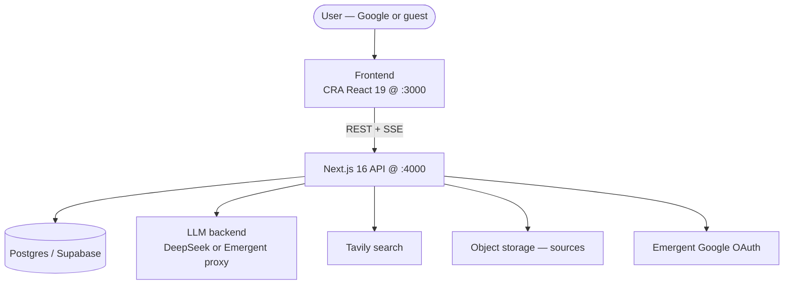
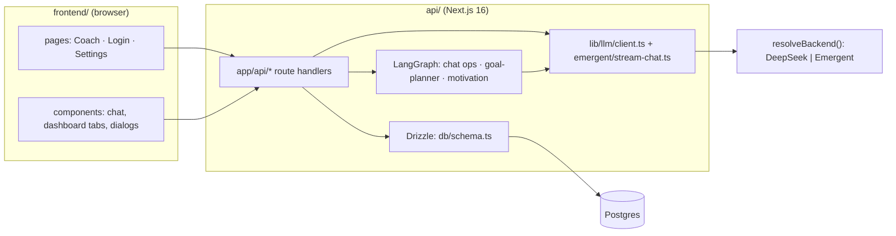
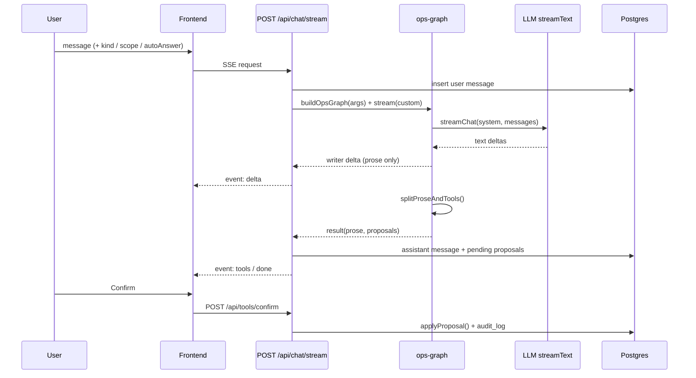

# Sutra — High-Level Design (HLD)

> **Audience:** founder + AI agents needing system orientation.
> **Status:** living document, derived from code on `main` (2026-10-03).
> **Scope:** system-wide "what and why". Per-module internals live in `docs/architecture/lld/` (backlog, see §12).
> **Source of truth:** the code. Where this doc and the code disagree, the code wins — and the doc is a bug.
> **Sibling:** `docs/architecture/agent-graphs.puml` (PlantUML surface map).

---

## 1. Purpose & scope

Sutra is a **chat-first AI life coach**. The chat is the conversational surface; a tracking dashboard is the readable view of the **same state**. Substantive state changes (goals, milestones, commitments, blockers) flow through the LLM as **tool proposals** that the user confirms inline.

This HLD covers:

- System context, containers, and the major components.
- The four key data flows (chat turn, planner HITL, motivation, daily tick).
- Cross-cutting concerns, NFRs, and the load-bearing design decisions.
- Invariants an agent must not break.

Out of scope here: exact request/response schemas, table columns, prompt wording, and node-level algorithm detail → those belong in LLDs.

### Product non-negotiables (from `memory/PRD.md`, `memory/AGENT_BUILDER.md`)

1. Chat is the surface; dashboard mirrors the same truth.
2. The LLM is the only writer to substantive state, and every change is confirmed by the user.
3. Cross-horizon synthesis is the wedge.
4. Persistence across sessions.
5. No streaks/calendar/settings-heavy v1.

---

## 2. System context

Actors and externals:

- **User** — Google-authenticated (Emergent OAuth) or **guest** (ephemeral token, migrates on sign-in).
- **LLM providers** — reached through one OpenAI-compatible backend: **DeepSeek** when `DEEPSEEK_API_KEY` is set, else the **Emergent proxy** (gemini / openai / anthropic). See `api/lib/emergent/backend.ts:22`.
- **Tavily** — web search for the motivation pipeline (optional; missing → empty "searching" response).
- **Postgres (Supabase)** — all durable state via Drizzle.
- **Object storage** — uploaded/linked **sources** (PDF/MD/TXT/CSV/JSON/images).
- **Hosting** — Vercel, deploying from `api/` (`api/vercel.json`).



---

## 3. Container view

| Container | Tech | Dev port | Prod |
|---|---|---|---|
| `frontend/` | React 19, CRA + craco, Radix/shadcn, Tailwind, react-router | 3000 | static build copied into `api/public` (see root `package.json` `build`) |
| `api/` | Next.js 16 route handlers, Drizzle ORM, AI SDK v7, LangGraph v1, zod | 4000 | Vercel (Root Directory = `api`) |
| Postgres | Supabase Postgres (pooled runtime / unpooled migrations) | — | managed |
| LLM | DeepSeek or Emergent proxy via `@ai-sdk/openai` | — | same |

Dev runs both via `node scripts/dev.js` (`pnpm dev`) with port cleanup. The production web build is statically served by the Next.js app.



---

## 4. Component map

### 4.1 Frontend (`frontend/src/`)

- **Pages:** `pages/Coach.js` (main app, owns `state` + `refreshState`), `pages/Login.js`, `pages/Settings.jsx`.
- **Dashboard tabs:** Overview, Timeline, Today (+ `TodayTimetable`), Sources, Memories, Motivation.
- **Chat surfaces:** `ChatModal`, `ChatConsole`, `FocusedTaskChatDialog`, `AddGoalDialog`.
- **Proposal UI:** `ToolConfirmationPrompt` (Confirm/Reject/Refine), `AskCard`, `NavigateCard`, `RenegotiationDialog`.
- **Client API:** `lib/api.js` — one wrapper for every endpoint; chat dispatch in `hooks/use-plan-send.js` (planner first, SSE fallback).
- **State flow:** mutations call `onChange` → `Coach.refreshState()` → `GET /api/state`.

### 4.2 API route layer (`api/app/api/`)

Thin adapters; business logic lives in `api/lib/`.

- **Chat:** `chat/stream` (SSE), `chat/plan` (planner JSON), `chat/refine`, `chat/history`, `chat/guest_stream`.
- **Tools:** `tools/confirm`, `tools/reject` — the only path that *applies* proposals.
- **Domain CRUD:** `goals`, `goals/[id]`, `milestones`, `milestones/[id]`, `commitments`, `commitments/[id]`, `blockers`, `blockers/[id]`, `timetable`, `timetable/[id]`.
- **Context:** `sources*`, `memories*`, `daily_log`, `state`, `preferences`, `preferences/models`, `motivation/recommend`.
- **Auth:** `auth/session`, `auth/guest`, `auth/logout`, `auth/me`, `auth/personas`, `auth/dev-login`.
- **Observability:** `audit`, `audit/export`.

### 4.3 LLM layer

- `lib/emergent/backend.ts` — `resolveBackend()` picks the active backend (DeepSeek → Emergent), throws if neither is configured.
- `lib/llm/client.ts` — the single structured-output entry. **3-path**: `generateObject` (json_schema, opt-in via `GOAL_PLANNER_USE_OBJECT_MODE`) → `json_object` (default) → `generateText` + JSON extraction. Zod-validated, one repair retry.
- `lib/emergent/stream-chat.ts` — streaming prose via AI SDK `streamText`; emits the `StreamEvent` contract.
- `lib/emergent/model-registry.ts` — provider table (`gemini | claude | openai`); MVP maps all three UI rows to `deepseek-flash` behind preserved labels.

### 4.4 Orchestration (LangGraph `StateGraph`s)

| Graph | File | Nodes | LLM nodes |
|---|---|---|---|
| Goal planner (HITL) | `lib/goal-planner/orchestrator.ts` | `n_intake → n_clarify → n_plan → n_headroom → n_emit → n_cross_validate` | intake, plan, emit |
| Chat ops | `lib/chat/ops-graph.ts` | `n_generate → n_refine → n_finalize` | generate, refine |
| Motivation | `lib/motivation/graph.ts` | `n_signals → n_search → n_fetch → n_critique → n_pick → n_frame → n_cache` | critique, frame |

Deterministic nodes (no LLM): `checkHeadroom`, `crossValidate`, `pickTopN`, drift. See §8, ADR-6.

### 4.5 Persistence (`api/db/schema.ts`)

`users`, `goals`, `commitments`, `milestones`, `blockers`, `conversations`, `messages`, `proposals`, `audit_log`, `sources`, `memories`, `timetable_blocks`, auth tables (`accounts`, `sessions`, `verification_tokens`, `user_sessions`), `state_overrides`, motivation tables (`motivation_cache`, `motivation_rejects`, `motivation_served_log`), `daily_log`, `plan_rejects`.

### 4.6 Cross-cutting services (`api/lib/`)

`auth-route.ts` / `request-user.ts` (auth), `audit.ts`, `cache.ts`, `drift-service.ts`, `goal-planner/headroom.ts`, `daily-log.ts`, `sources.ts`, `storage.ts`, `over-commitment.ts`, `dashboard-state.ts`.

---

## 5. Key data flows

### 5.1 Chat turn → propose → confirm (all chat kinds)

Every state-changing proposal flows through the **ops graph** (`/api/chat/stream`) or the **planner** (`/api/chat/plan`); `/api/chat/stream` is a thin SSE adapter. The wire format is preserved across the AI-SDK migration: `delta | tools | needs_clarification | done | error`.



Two write models:

- **Propose→confirm** (LLM path): goals/milestones/commitments/blockers. 9 actions in `lib/proposal-tools.ts`, applied by `lib/proposal-executor.ts`.
- **Direct CRUD** (scheduling/constraint data, hard constraint #2): blockers, timetable blocks, daily log — no confirm.

### 5.2 Goal planner HITL (interrupt / resume)

`n_clarify` is a real `interrupt()`; state persists via a **Postgres checkpointer** (`lib/goal-planner/checkpointer.ts`; `MemorySaver` in dev/test), and `/api/chat/plan` resumes a pending interrupt. `thread_id = conversationId`. Comments/notes for the node graph live in `agent-graphs.puml`.

### 5.3 Motivation SWR

`/api/motivation/recommend` returns cache synchronously and warms in the background:

```mermaid
flowchart LR
  REQ[request] --> BUCKET[detectBucket + auth]
  BUCKET --> FLAG{MOTIVATION_AGENT_ENABLED?}
  FLAG -- no --> EMPTY[empty "searching"]
  FLAG -- yes --> CACHE{cache?}
  CACHE -- "hit ≤60m" --> HIT[cached items]
  CACHE -- "stale ≤24h" --> STALE[stale items + background run]
  CACHE -- miss --> MISS[empty "searching" + background run]
  STALE --> PIPE[runPipeline]
  MISS --> PIPE
  PIPE --> SIG[n_signals] --> SEARCH[n_search] --> FETCH[n_fetch] --> CRIT[n_critique] --> PICK[n_pick] --> FRAME[n_frame] --> CACHEW[n_cache]
```

Dedup by `userId:bucket:stateHash`; master deadline 20s, cost cap $0.25.

### 5.4 Commitment tick → drift + daily log

`PATCH /api/commitments/[id]` updates the row in a transaction with an audit entry, then best-effort: **drift recompute** on the becoming-done edge, and **daily-log merge** when a note is present and the commitment is due today. See `api/app/api/commitments/[id]/route.ts`.

---

## 6. Cross-cutting concerns

### Auth & tenancy

`lib/request-user.ts` resolves, first match wins: (1) Emergent/Auth.js session, (2) legacy `guest_token` cookie, (3) `Authorization: Bearer` **only** in dev/test. Guests auto-migrate to the account on sign-in. Every domain query is scoped by `userId`.

### Audit

Substantive writes and daily-log/commitment changes append to `audit_log` (`lib/audit.ts`), surfaced in the Honesty audit view and `/api/audit/export`.

### Caching & invalidation

`lib/cache.ts` with request-scoped invalidation at the auth choke-point. Dashboard reads are not cached long; motivation has its own TTL cache (60m hit / 24h stale).

### Feature flags

- `GOAL_PLANNER_ENABLED` — **default ON** (`lib/goal-planner/config.ts:35`); `GOAL_PLANNER_USER_ALLOWLIST` narrows rollout.
- `MOTIVATION_AGENT_ENABLED` — **on except `NODE_ENV=test`** unless overridden.
- `GOAL_PLANNER_USE_OBJECT_MODE` — opt-in native json_schema.

---

## 7. Non-functional requirements

| Concern | Bound | Where |
|---|---|---|
| Planner pipeline deadline | 55s (fits route `maxDuration = 60`) | `app/api/chat/plan/route.ts:58` |
| Motivation pipeline deadline | 20s | `lib/motivation/config.ts:98` |
| Motivation cost cap | $0.25 / call | `lib/motivation/config.ts:147` |
| Plan bounds | 2–4 phases, 3–5 milestones, 1–3 commitments, ≤8 tools, ≤2 questions | `lib/goal-planner/config.ts` |
| Renegotiation rounds | ≤2 | `lib/goal-planner/config.ts:62` |
| Daily served-card cap | 20 | `lib/motivation/config.ts:118` |

Observability: structured stage logging + `plan_rejects` / `motivation_rejects`. Rollout safety: flags above, with deterministic gates so a bad model run degrades to `no_change` / an empty "searching" response rather than bad state.

---

## 8. Key decisions & tradeoffs

- **ADR-1 — LLM proposes, human confirms.** The model never writes directly; it emits ops that the user confirms. Direct CRUD is reserved for scheduling/constraint data.
- **ADR-2 — `[[TOOLS]]` text block, not SDK `tool_calls`.** The backend is OpenAI-compatible but doesn't reliably expose the tool-call channel with our 9 schemas, so proposals ship as a text block parsed server-side; streaming prose is suppressed from it.
- **ADR-3 — LangGraph `StateGraph` + Postgres checkpointer.** Gives durable HITL clarify/resume and explicit deterministic nodes between LLM calls.
- **ADR-4 — SWR motivation.** Users never wait on the pipeline; cache serves, background refreshes.
- **ADR-5 — one physical backend behind relabeled providers.** All three UI rows currently resolve to the same model to keep MVP simple; labels are preserved for the switcher.
- **ADR-6 — deterministic validators.** `crossValidate`, `checkHeadroom`, `pickTopN`, and drift verdicts are computed in code, never by the LLM.

---

## 9. Invariants & gotchas (do not break)

- **General chat is read-only** — it may emit only `navigate` / `ask` (`lib/chat/ops-graph.ts:255`, `lib/llm/prompts.ts:59`).
- **Wire format is frozen** — `delta | tools | needs_clarification | done | error`; `/chat/plan` uses JSON statuses (`ok | clarify | renegotiate | no_change | early | disabled | not_planned`).
- **The 9 actions are the only substantive writes**; `crossValidate` filters each intent's allowed subset (`lib/goal-planner/schemas.ts:75`).
- **Drift recompute is edge-triggered** (becoming-done / daily-log / blocker change), not on every read.
- **Stale doc comments exist.** `app/api/chat/plan/route.ts:10` says the planner flag is "off by default", but `lib/goal-planner/config.ts` now defaults it **ON**. Trust the code.
- **README port drift.** `README.md` structure section says the API is `:3001`; the actual dev port is **4000** (`scripts/dev.js`, `package.json`).
- **`packages/ai/src/tools.ts` is legacy** and not the live action set; the live set is `lib/proposal-tools.ts` / `lib/proposal-executor.ts`.

---

## 10. Glossary

| Term | Meaning |
|---|---|
| **Proposal** | A pending tool action the LLM emitted, awaiting user confirm/reject. |
| **Op** | One of the 9 state-changing actions. |
| **Kind / intent** | Conversation scope: `general`, `add_goal`, `plan_day`, `edit_goal`, `drop_goal`, `review_progress`. |
| **Headroom** | Pure check of whether a plan fits available hours. |
| **Drift** | `on_track | at_risk` status computed from milestones/commitments. |
| **Daily log** | Per-(user, day) memory injected into the coach prompt. |
| **Bucket / refId** | Per-entity conversation isolation key. |

---

## 11. Diagram index

- `docs/architecture/agent-graphs.puml` — overview + planner, motivation, and chat-ops graphs (PlantUML).
- This file — Mermaid context, container, sequence, and flow diagrams.

---

## 12. LLD backlog (`docs/architecture/lld/`)

`01-llm-client.md`, `02-goal-planner.md`, `03-chat-ops-graph.md`, `04-proposal-executor.md`, `05-motivation-pipeline.md`, `06-api-reference.md`, `07-data-model.md`, `08-state-prompt-assembly.md`, `09-auth.md`, `10-daily-log-drift-timetable.md`.

### Open items to verify in the LLD pass

- Reconcile the stale planner-flag comment and the README port drift (§9).
- Confirm whether `docs/conventions/` exists for the `AGENTS.md` doc-reconciliation layer, or fold that here.
- Add an ADR for the checkpointer's `setup()` behavior on first prod use.
